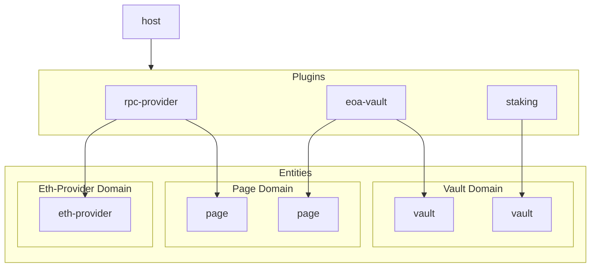

# Lodgelock

!!! Pre-alpha: use at your own risk !!!

Lodgelock is designed as a modular-first wallet framework. It aims to empower the web3 ecosystem by providing a user-centric, secure, and extensible wallet platform.

Lodgelock is designed around three core ideals:

1. **Wallets for self-sovereignty**: Wallets are tools for users to manage their money, identity, and data. They should empower users to hold ownership over their digital lives, providing full control and autonomy.
2. **Wallets for security**: Wallets act as guardians of users' assets and personal information. They are a critical single point of failure and must prioritize security at all times.
3. **Wallets for modularity**: Wallets should act as the interface for web3 interfactions. They should provide a secure and unbiased platform that manages security and resources, leaving the 'user-space' features to the user's discretion.

## Docs

- [Architecture Overview](./docs/ARCHITECTURE.md)
- [Plugin Development Guide](./docs/PLUGIN_DEVELOPMENT.md)
- [Security Model](./docs/SECURITY.md)

## Status Quo

The current wallet landscape is dominated by walled gardens that bundle a fixed set of features. DeFi's origin in websites has been a saving grace, allowing users to access a broader ecosystem of applications. Wallets, however, have not embraced this modularity.

This lack of modularity has created strong **Extractive Incentives** through the **Power of Defaults**. Wallets decree what features are present within their walls, shaping experience for millions. 

For a prime example, compare the exchange rates provided by Metamask's built-in swap versus uniswap or 1inch. Or consider the recent move by many wallets to integrate ~~Gambling~~ predictive markets directly into their apps, often with no warning, age verification, or even an option to disable the feature.

While users should undoubtedly have the freedom to use such dapps, they should not be forced to participate. When the gateway to web3 is a profit-seeking entity, the default becomes a toll-bridge rather than an open road.

## How it Works

Lodgelock is built as an entity-domain-plugin architecture.

Entities are the core building blocks of Lodgelock. They represent the objects users interact with. For example, an entity might represent a "vault." This vault could be an EOA, a multisig wallet, a hardware wallet, a custodial exchange account, or more. 

While all of these vaults would have different implementations they all share the same interface, defined by the "vault" domain.

Domains are standard interfaces implemented by entities. They are designed to be as generic as possible so that wide varieties of functionality can share common APIs. Domains include `vault`s, `eth-providers`, `pages`, `coordinators`, and more. Any entities that implement the same domain can be used interchangably.

Plugins are what create and manage Entities. They're written as WebAssembly (WASM) modules and run in a secure environment by Lodgelock. Plugins can create entities, manage their state, and interact with other plugins through well-defined interfaces.



For more information, view the [Architecture Overview](./docs/ARCHITECTURE.md).

## Getting Started

Lodgelock is currently in early pre-alpha development. To try out a web demo, visit [http://localhost:8788/](http://localhost:8788/).

### Web Demo Instructions 

The web demo is a simple browser-based wallet using Lodgelock. It includes a curated set of plugins and a handful of demo snapshots that can be loaded. All demos are ephemeral and do not store any data permanently. The demos also use revm-providers as the RPC backend, so all actions are simulated locally and certain cheatcodes are available for testing.

The "stake" demo loads in a vault, revm-provider, and staking plugin. The vault was pre-funded with test ETH and WETH. The user can stake and unstake WETH using the staking plugin's interface.  Try staking some ETH, then unstaking back to your eoa-vault!
 - Because the staking plugin lives locally, it's not dependant on any external services. It's a local app, not a webpage that can go down.
 - Additionally, the staking plugin has access to the full capabilities of tlock. This means in addition to creating a page for user interactions, it also creates a vault entity which represents the custodially held value and could be used interchangably with any other vault.

The "swap" demo loads in a vault, coordinator, revm-provider, uniswap plugin. The vault was again pre-funded with test ETH and WETH. The user can swap between a few different tokens using the uniswap plugin's interface. Try swapping some WETH for DAI!
  - Similar to the staking plugin, the uniswap plugin is entirely local.
  - Rather than directly communicating with the vault, the uniswap plugin instead uses the coordinator, which provides atomic-like interfaces for executing batches of transactions. This ensures that regardless of the swap outcome, all user funds are returned to the vault safely.

### Running Locally

To build from source, Lodgelock uses [Nix](https://nixos.org/) to manage dependencies and build environments. Alternatively, you can manually install the required dependencies listed in `shell.nix`.

(Devcontainer coming soon)

```bash
git clone git@github.com:Robert-MacWha/tlock-rs.git
cd tlock-rs
nix-shell # Enter nix shell with dependencies. Alternatively, install the listed dependencies manually.
make plugins # Build all plugins
cd frontend

# Concurrently run tailwindcss watcher, dioxus dev server, and chrome with various security features to allow SharedArrayBuffer
dev # Provided by shell.nix
```

## Roadmap

See the [project board](https://github.com/Robert-MacWha/tlock-rs/issues) for current tasks and progress.

## License

This project is currently unlicensed while in pre-alpha development.

## Open Questions

- State mechanism. Currently implemented the plans outlined in [state.md](./docs/state.md) which is essentially a key-value mutexed storage. This allows plugins to store state and prevents state corruption from concurrent access. However, it also limits concurrent access to state which may be a future bottleneck.
- Cross-chain abstractions. Using CAIP standards for chain, account, and asset IDs. Chain-specific domains (e.g. eth-provider, coordinator) are currently chain-specific. Should these be abstracted, or is it better to create new domains for different chains (and thus harm the 90/10 rule)?
- Will plugin management UX be acceptable?
  - Managing plugins requires non-trivial user comprehension of what the plugins are and how they interact. Conceptually this is similar to browser extensions, homeassistant plugins, or desktop environments. However, wallets are security-critical software and users should be less willing to tinker.
  - In actual distributions, the host should ship with a curated set of plugins by default (some enabled, some optional) to provide a good out-of-the-box experience.
    - Similar to the web browser demo I've built for the alpha.
  - I'm considering adding more fine-grained domains (e.g. "swap", "stake", "bridge") to allow plugins to be better categorized and for generic UIs to be built around them. This way users could easily find and install plugins for specific features, for example if they notice their swap plugin is missing a certain token they want or they want to try a different staking provider.
