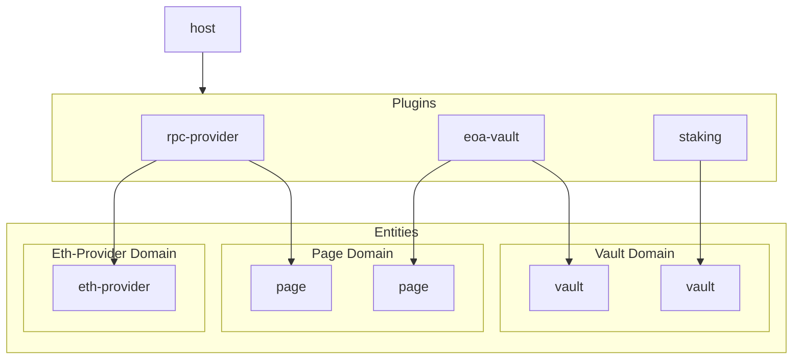

<h1>
  
  Lodgelock
</h1>

!!! Pre-alpha: use at your own risk !!!

Lodgelock is designed as a modular-first wallet framework. It aims to empower the web3 ecosystem by providing a user-centric, secure, and extensible wallet platform.

Lodgelock is designed around three core ideals:

1. **Wallets for self-sovereignty**: Wallets are tools for users to manage their money, identity, and data. They should empower users to hold ownership over their digital lives, providing full control and autonomy.
2. **Wallets for security**: Wallets act as guardians of users' assets and personal information. They are a critical single point of failure and must prioritize security at all times.
3. **Wallets for modularity**: Wallets should act as the interface for web3 interfactions. They should provide a secure and unbiased platform that manages security and resources, leaving the 'user-space' features to the user's discretion.

## Getting Started

Lodgelock is currently in early pre-alpha development. To try out a web demo, visit [lodgelock.org](https://lodgelock.org/).

For docs on each of the plugins included in the demo, see the [Plugins Overview](./docs/PLUGINS.md).

https://github.com/user-attachments/assets/ff235300-1843-4737-a4ec-a1cceda49dbb

(For full-res video, see on [youtube](https://youtu.be/OxjImnTXKI0))

## Docs

- [Architecture Overview](./docs/ARCHITECTURE.md)
- [Security Model](./docs/SECURITY.md)
- [Plugin Development Guide](./docs/PLUGIN_DEVELOPMENT.md)
- [Plugins Overview](./docs/PLUGINS.md)

## Status Quo

The current wallet landscape is dominated by walled gardens that bundle a fixed set of features. DeFi's origin in websites has been a saving grace, allowing users to access a broader ecosystem of applications. Wallets, however, have not embraced this modularity.

This lack of modularity has created strong **Extractive Incentives** through the **Power of Defaults**. Wallets decree what features are present within their walls, shaping experience for millions. 

For a prime example, compare the exchange rates provided by Metamask's built-in swap versus uniswap or 1inch. Or consider the recent move by many wallets to integrate ~~Gambling~~ predictive markets directly into their apps, often with no warning, age verification, or even an option to disable the feature.

While users should undoubtedly have the freedom to use such dapps, they should not be forced to participate. When the gateway to web3 is a profit-seeking entity, the default becomes a toll-bridge rather than an open road.

## How it Works

Lodgelock is built as an entity-domain-plugin architecture.

Entities are the core building blocks of Lodgelock. They represent the objects users interact with. For example, an entity might represent a "`vault`". This vault could be an EOA, a multisig wallet, a hardware wallet, a custodial exchange account, or more. 

While all of these vaults would have different implementations they all share the same interface, defined by the "`vault`" domain.

Domains are standard interfaces implemented by entities. They are designed to be as generic as possible so that wide varieties of functionality can share common APIs. Domains include `vault`, `eth-provider`, `page`, `coordinator`, and more. Any entities that implement the same domain can be used interchangably.

Plugins are what create and manage Entities. They're written as WebAssembly (WASM) modules and run in a secure environment by Lodgelock. Plugins can create entities, manage their state, and interact with other plugins through well-defined interfaces.



For more information, view the [Architecture Overview](./docs/ARCHITECTURE.md).

### Running Locally

Lodgelock uses [nix-shell](https://nixos.org/guides/nix-pills/10-developing-with-nix-shell.html) for dependency management. You can also manually install the required dependencies listed in `shell.nix`.

(Devcontainer coming soon probably)

To run the web demo locally:

```bash
git clone git@github.com:Robert-MacWha/lodgelock.git
cd lodgelock
nix-shell # Enter nix shell with dependencies. Alternatively, install the listed dependencies manually.
make plugins-release # Build all plugins
cd frontend

# Serve the web demo locally
dx serve --platform web

# Launches chrome with COOP/COEP security disabled. Required for development
# but highly insecure for everyday browsing.
# 
# See the `chromeUnsafe` definition in `shell.nix` for more details.
chrome-unsafe
```

## Roadmap

See the [project board](https://github.com/Robert-MacWha/lodgelock/issues) for current tasks and progress.

## License

This project is currently unlicensed while in pre-alpha development.

