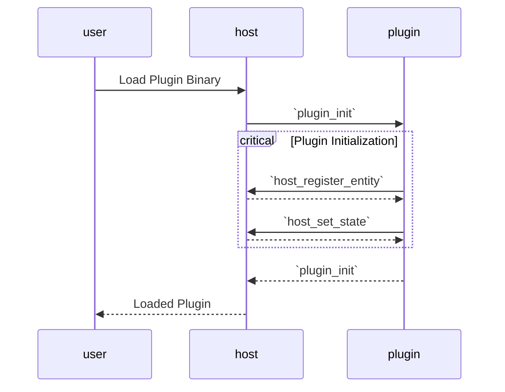

# Architecture

Lodgelock takes cues from [HomeAssistant's core architecture](https://developers.home-assistant.io/docs/architecture/core) and [Unix philosophy](https://cscie2x.dce.harvard.edu/hw/ch01s06.html) to create a modular, extensible wallet platform.

## Goals

### 90/10 Implementation Rule

90% of the wallet's functionality should be implemented through plugins. Only 10% of features should require host updates.

**Plugin-only updates**:
- New chains using existing models (EVM variants reusing Ethereum types)
- New signature generation methods (MPC, multi-sig wallets)
- New key management approach
- Complex workflows (bridging, social recovery, DeFi protocols)
- UI enhancements and analysis features

**Host updates required**:
- New domains
- New host functions / services

### Security

Plugins are untrusted code. Users should be able to install plugins from third parties, and should be protected from buggy or malicious plugins.

## Architecture

- The **Host** is the secure, stable 'kernel' that manages plugins, routes requests, and provides core services like storage and networking.
- The **Plugins** are modular implementations of wallet functionality. They implement defined domains (Vault, Provider, Coordinator, Page) and communicate through the host.
- The **Frontend** is the user interface layer that interacts with users and presents data from plugins

### Entities

Entities are implementations of domains provided by plugins.  A single entity implements a single domain.  A single plugin may register multiple entities across multiple domains.

```
Plugin: eoa-vault
  Entity: vault:abc123 (Vault domain)
  Entity: page:def456 (Page domain)

Plugin: eoa-coordinator
  Entity: coordinator:ghi789 (Coordinator domain)
  Entity: vault:jkl012 (Vault domain)
  Entity: page:mno345 (Page domain)
```

Entities are designed as black boxes. The host and other plugins do not know about their implementation details. They only care what domain they implement. As such, entities communicate securely through their domain-defined interfaces and different entities may rely on each other to provide complex functionality.

### Domains

Domains are semantic categories that define what an entity does. Each domain has a fixed set of interfaces all implementations must follow. Domains include:

| Domain      | Purpose                             | Example Methods                                                       |
| ----------- | ----------------------------------- | --------------------------------------------------------------------- |
| Vault       | Custody and transfer of assets      | `GetAssets`, `Withdraw`, `GetDepositAddress`                          |
| Provider    | Blockchain interfacing              | `BlockNumber`, `GetBalance`, `GetBlock`, `Call`, `SendRawTransaction` |
| Coordinator | Safe on-chain transaction execution | `GetSession` `GetAssets` `Propose`                                    |
| Page        | UI Rendering                        | `OnLoad` `OnUpdate`                                                   |

Domains are designed to be as generic as possible while providing useful abstractions. A vault may be a simple private key manager on ethereum or a multisig, a hardware wallet, an MPC signer, a privacy pool account, a dapp's internal custodial ledger, or a CEX with an API. So long as it can hold custody of and transfer assets, it can implement the vault domain.

For more information on domains, see below.

### Plugins

Plugins are the packages of code that provide entities. Plugins are implemented as WASM modules (wasm32-wasip1) that the host loads and manages. During execution, plugins are entirely sandboxed, only able to communicate externally or store data through host calls.

#### Plugin Lifecycle


## Host Services

## Performance

Plugins are run in sandboxed WASM runtimes. While this provides strong security guarantees, it also introduces some performance overhead compared to native code execution. Lodgelock is built on [wasmer](https://wasmerio.github.io/wasmer/crates/doc/wasmer/), a fast, cross-platform WASM runtime with [good performance](https://wasmruntime.com/en/benchmarks).

 - For desktop and Android frontends, wasmer can use its native JIT or AOT backends.
 - For browser-based frontends, wasmer uses the browser's built-in WASM runtime like V8 or SpiderMonkey. This provides good performance, often better than native JavaScript execution.
 - For IOS frontends, wasmer uses an interpreted backend due to IOS's JIT restrictions. This results in slower performance, which I'll need to benchmark.


### Plugin Communication

The host runs plugin guest instances in sandboxed wasm32-wasip1 runtimes. Bidirectional communication is facilitated over JSON-RPC over STDIO. This is used because it is a simple, highly compatible protocol that works across languages and is resistant to forward/backward compatibility issues.

For more details on the runtime environment, see the [wasi-plugin-framework](https://github.com/Robert-MacWha/wasmi-plugin-framework/tree/wasmer-shared-memory-test) repo.

### Host Calls

The host exposes various services to plugins through host calls. These include:
    - Persistent Storage
    - Network Fetching
    - Page Management
    - Creating Entities
    - Requesting Entities
    - Inter-plugin Communication

For a full list of host calls, see the [tlock-api docs](../crates/tlock-api/src/lib.rs).

## Domain Details

Below are details on each domain, including their APIs and purpose. For full API definitions, see their definitions in the [tlock-api](../crates/tlock-api/src/lib.rs).

### Vault Domain

```rust
rpc_method!(vault_get_assets, GetAssets, VaultId, Vec<(AssetId, U256)>);
rpc_method!(vault_withdraw, Withdraw, (VaultId, AccountId, AssetId, U256), ());
rpc_method!(vault_get_deposit_address, GetDepositAddress, (VaultId, AssetId), AccountId);
```

Vaults provide custody of assets. They help to unify all the different custody models that exist in the crypto ecosystem.

Anything that can control some on-chain assets can implement a vault. Vaults may: 
 - use transactions signed by a private key, 
 - multisig wallets, 
 - custodial APIs, 
 - or more. 

As long as they can receive, hold, and send assets, they can implement the vault domain.

### Provider Domain

```rust
rpc_method!(eth_blockNumber, BlockNumber, EthProviderId, u64);
rpc_method!(eth_chainId, ChainId, EthProviderId, U256);
rpc_method!(eth_call, Call, (EthProviderId, TransactionRequest, BlockId, Option<StateOverride>, Option<BlockOverrides>), Bytes);
rpc_method!(eth_gasPrice, GasPrice, EthProviderId, u128);

...
```

Providers interface with blockchains. They help other plugins interact with the chain while giving users control over those interactions.

Providers may vary widely in implementation. They may:
 - directly call json-rpc endpoints, 
 - implement a light client like helios, 
 - fork the chain with revm, 
 - or more.

This flexibility allows different provider implementations optimized for different use-cases. Developers may use revm for testing dapps and plugins locally, while end-users may use a light client for maximum security and decentralization.

### Page Domain

```rust
#[non_exhaustive]
#[derive(Serialize, Deserialize, Debug)]
pub enum PageEvent {
    ButtonClicked(String),                          // (button_id)
    FormSubmitted(String, HashMap<String, String>), // (form_id, form_values)
}

rpc_method!(page_on_load, OnLoad, PageId, ());
rpc_method!(page_on_update, OnUpdate, (PageId, PageEvent), ());
```

Pages provide UI rendering for plugins. This lets plugins interact with users generically, creating custom user interfaces for adjusting settings, interacting with dapps, viewing information, and more.

> It is an open question whether pages should be as fully featured as traditional web pages (HTML/CSS), or if the host should enforce stricter styling and layout rules to ensure a more unified user experience (theming/accessibility). I'll probably implement both options and leave it up to plugin developers to choose.

### Coordinator Domain

```rust
//? Inspired by Railgun's smart contract recipes API
//? https://docs.railgun.org/developer-guide/cookbook/write/step
#[derive(serde::Serialize, serde::Deserialize, Clone, Debug)]
pub struct EvmBundle {
    pub inputs: Vec<(AssetId, U256)>,
    pub outputs: Vec<AssetId>,
    pub operations: Vec<EvmOperation>,
}

#[derive(serde::Serialize, serde::Deserialize, Clone, Debug)]
pub struct EvmOperation {
    pub to: Address,
    pub value: U256,
    pub data: Vec<u8>,
}

rpc_method!(coordinator_get_session, GetSession, (CoordinatorId, ChainId, Option<AccountId>), AccountId);
rpc_method!(coordinator_get_assets, GetAssets, (CoordinatorId, AccountId), Vec<(AssetId, U256)>);
rpc_method!(
    coordinator_propose_evm,
    Propose,
    (CoordinatorId, AccountId, EvmBundle),
    ()
);
```

Similarly to how vaults are abstracted custody, coordinators are abstracted execution. They handle the complexity of withdrawing from vaults, executing transactions, and depositing results back while handling faliure cases.

Without coordinators, plugins executing transactions must:
1. Create their own EOAs
2. Withdraw from vault to EOA
3. Execute transactions
4. Deposit back to vault
5. Handle all failure cases

A bug in this flow in any plugin leaves funds stuck outside vault custody. Coordinators solve this by centralizing execution logic so plugins can simply propose a batch of actions to a coordinator:

```rust
// Pseudocode example of using a coordinator to execute a swap transaction
coordinator.propose(
    inputs: [(AssetId::USDC, 1000)],
    outputs: [(AssetId::ETH, ~0.3)],
    transactions: [swap_tx],
)
```

The coordinator handles:
- Validating vault balances
- Withdrawing inputs
- Executing transactions
- Verifying outputs
- Depositing results
- Failure recovery (all-or-nothing)

This simplifies plugin development and reduces risk of accidentally lost funds.
