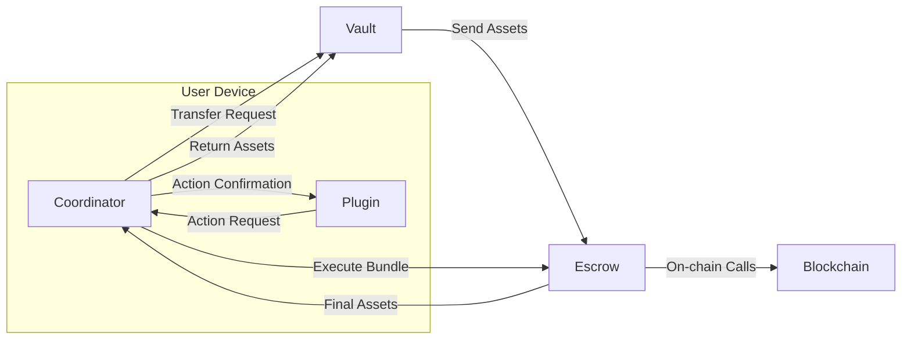
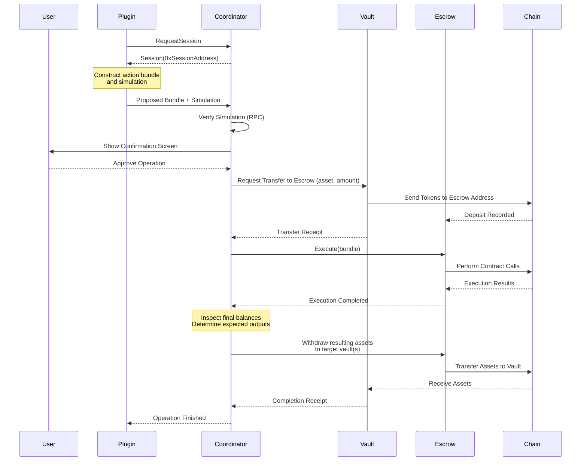
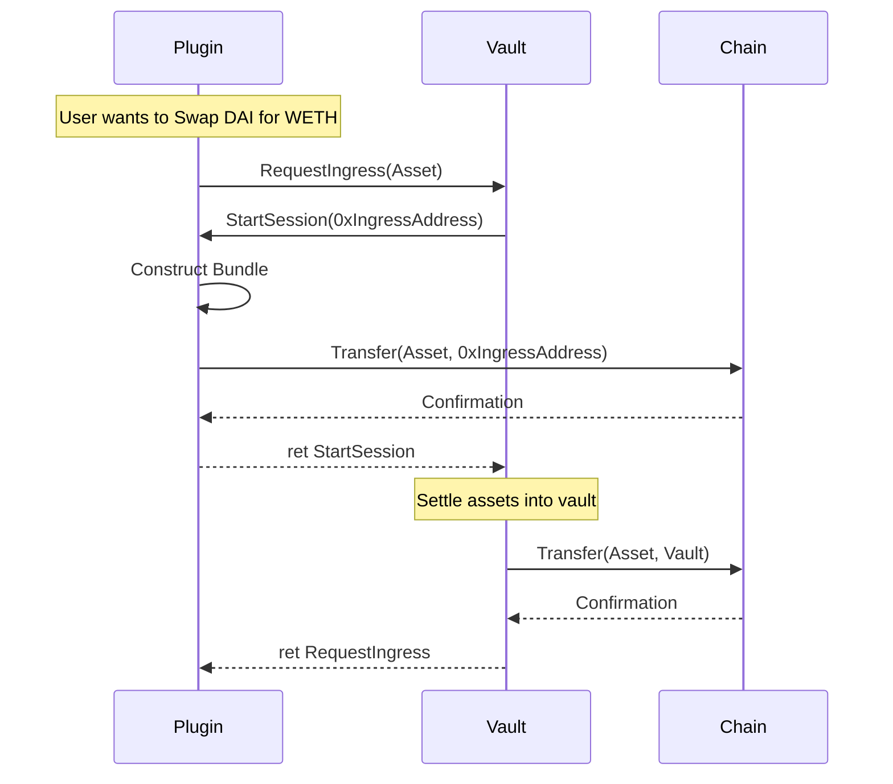
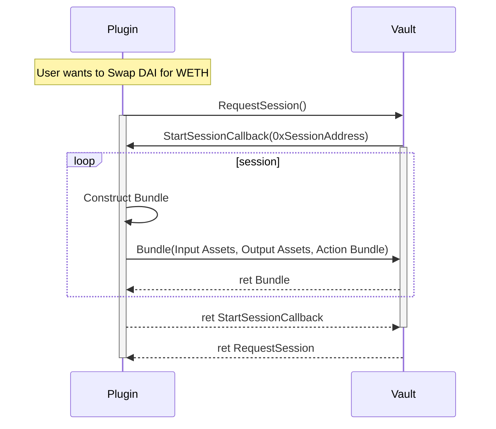
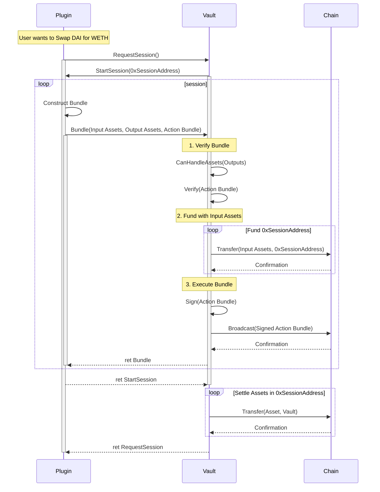

# Vault Architecture

This design splits core responsibilities across two domains: Vault (Storage/Signing) and Plugin (Logic/Intent).

## 1. Axioms

1. The custodian of assets are the most trusted party regarding those assets.
2. Assets must never be lost due to systematic failures.
   1. Plugins may fail, misbehave, or be incompatible.
   2. The blockchain may reorg or fail to confirm transactions.
3. Isolation of concerns is critical for security and maintainability.
   1. Vaults should be unaware of the complexities of the blockchain.
   2. Plugins should be unaware of the inner workings of vaults.
4. We want to minimize the total number of unique trusted objects
   1. Where a trusted object basically means a function on an entity

## 2. Entities and Responsibilities

### Vault

- Custody of assets
- Authority over egress of assets
- Authority to accept / reject ingress of assets

Vaults are opaque and can be any system capable of holding and transfering assets. This includes EOAs, smart accounts, hardware wallets, multisigs, CEXs, bank accounts, etc.

### Plugin

- Business logic
- Construct operations

### Coordinator

"Authority over what actions can be performed on what assets"

- Coordinate between Vaults and Plugins
- Interprets plugin intent
  - Simulates plugin operations
  - Shows confirmation UIs
- Asks vault to transfer assets to Escrow
- Controls Escrow account
- Withdraws assets from Escrow back to Vault

Coordinators execute operations through an *operator* account smart account using the Escrow. To limit exposure, Coordinators may use a fresh operator account for each operation, or for each session, or may use the same operator account persistently. The default operator account model cannot be assumed by plugins.

Some plugins may require persistent accounts (e.g. for staking, voting, etc). In these cases, plugins may explicitly request the use of a previously allocated operator account. Coordinators must always be able to use any previously allocated accounts.

```rust
/// If Some(AccountId) is provided, and the coordinator has previously allocated it, it MUST be used.
RequestSession(Option<AccountId>) -> Result<AccountId, Error>
```

### Escrow (Smart Contract Account)

- Receives assets from Vaults
- Executes arbitrary operations on behalf of Coordinator
- Only allows execution of valid bundles (signed, within a block range, etc)
- Allows Coordinator to withdraw assets back to Vaults
- Acts as a temporary "session account"

Escrows are technically implementation details of Coordinators, but are important enough to be called out seperately.  Coordinators may use whatever mechanism they desire to hold assets during operators and return assets to vaults, so long as they fufill the Coordinator Domain.  Escrows are simply the cannonical and most secure way to do this I've found so far.

The existance of Escrows cannot be assumed, and Vaults and Plugins need not be aware of them.

This is an interesting semi-related topic:
    - https://github.com/ethereum/L2-interop/blob/main/docs/intents/atomic-swaps.md

## 3. Operational Flows

### Relationship Graph



### Operation Flow


## 4. Safety Guarantees

1. Plugins NEVER hold assset custody
2. Vaults hold asset custody at rest
3. Coordinators hold asset custody ONLY during operations
4. Funds are never stuck in limbo
   1. Funds are only ever held by Vaults (at rest) or Escrow (during operations)
5. Funds in Escrow can always be returned to vaults by the coordinator.
6. Plugins cannot bypass coordinator validation.

### Wishes

- Make it possible to have fully atomic userActions.
  - Right now there are 2-3 separate steps - vault transfer to coordinator, coordinator executes, coordinator returns to vault.
  - Steps 2 and 3 can be made atomic via escrows / 4337, but step 1 cannot since it is initiated by the vault.
  - I know this is impossible without placing undue burden on vaults, but it's a nice to have.
  - Technically it's kinda possible if vaults are willing to create temporary accounts, or if coordinators create those temporary accounts.  Would add an intermediary step to the escrow of a new ephemeral account that's created and approves transferFroms.  But that'd be highly situational and complex.

###  Risk Factors

This section lists architecture-level risks that exist in any system built on the Vault–Coordinator–Plugin–Escrow model. These risks do not depend on plugin logic or execution strategies. They are inherent to the structure.

#### 1. Coordinator Key Compromise

The Coordinator controls Escrow. If its key is compromised, any assets held in Escrow are at risk.

**Mitigations:**

- Users must control Coordinator keys.
- Users must be able to rotate or revoke Coordinators.
- Coordinators should limit exposure by keeping sessions short and closing them after completion.

#### 2. Coordinator Malfunction

A Coordinator may simulate incorrectly, mis-handle a bundle, or fail during a session.

**Impact:**
Assets may remain in Escrow or settle incorrectly.

**Mitigations:**

- Coordinators must track in-flight sessions.
- Coordinators must detect incomplete or failed sessions and resume or cancel them.
- Coordinators must not assume plugin correctness.

#### 3. Escrow Contract Bugs

Escrow executes arbitrary calls on Coordinator instruction. A bug in Escrow may freeze or leak assets.

**Mitigations:**

- Keep Escrow simple and minimal.
- Avoid storing long-lived state in Escrow.
- Restrict withdrawal authority to the Coordinator and the originating Vault.

#### 4. Vault Bugs or Vault Misbehavior

Vaults control custody. If a Vault signs the wrong transaction, accepts unsupported assets, or mis-routes outputs, assets may be lost or stranded.

**Mitigations:**

- Vaults must verify output assets before accepting them.
- Vaults must enforce their own capability model.
- Vaults must never assume plugin correctness.

#### 5. Plugin Misbehavior

Plugins may propose harmful or incompatible bundles. Plugins do not have custody, but they can request actions that place assets at risk if unchecked.

**Mitigations:**

- Coordinators must simulate all plugin operations.
- Coordinators must present clear confirmations to the user.
- Coordinators must reject bundles when simulation and expected outcomes diverge.

#### 6. Asset Compatibility Errors

A plugin may output assets or token types that a Vault cannot handle.

**Impact:**
Assets might return to a Vault that cannot transfer or recognize them.

**Mitigations:**

- Vaults must validate output asset compatibility before signing a session.
- Coordinators must check vault capability against plugin intent.

#### 7. Lost Session Recovery

A crash or reset may occur after the Vault has already sent assets to Escrow.

**Impact:**
Assets remain in Escrow with no completion logic running.

**Mitigations:**

- Escrow should include a safe recovery path that allows the Vault to reclaim assets.
- Coordinators must persist session metadata and recover after restarts.

#### 8. Chain Nondeterminism (Reorgs and Partials)

A chain reorg or dropped transaction may leave a session half-complete.

**Impact:**
Escrow or Vault may diverge from expected state.

**Mitigations:**

- Coordinators must re-check state before final settlement.
- Vaults should re-verify balances on output.
- Escrow should treat execution as idempotent.


# Notes

## 1. Statements

1. The place that is currently holding assets is more trustworthy than any external logic.
   1. More specifically, this item is already "trusted" to hold assets. Trusting external logic means expanding the trust boundary, and increasing risk.
   2. We don't want the user to be forced to 100% trust any new plugin they add. Plugins can be buggy, malicious, or simply misconfigured. If that's the case, the user and the vault should be given the ability to see the issue and prevent asset loss.
   3. Therefore, vaults should always have the final say over what happens to their assets. 
   4. This means that we should try to keep asset custody within vaults.
      1. This statement is in conflict with my goal of separating logic and storage.
      2. So perhaps we need to properly separate them, and trust both the vault and some "master executor" that coordinates between plugins and vaults.  
2. Assets should never become inaccessible or lost due to systematic failures.
   1. If an operation cannot be completed, assets cannot be lost.
   2. Incompatible assets cannot be sent to a vault that cannot handle them.

I feel like I'm loosing the thread.  Vaults should be simple, and only responsible for custody and transfer of assets.  Plugins should represent logic.  I might need a third thing to coordinate between them, something that can be trusted enough by vaults to not loose assets, and interact with plugins on their behalf.  To act as an EOA / smart account perhaps?  Probably a per-chain abstraction of the two?

~~~
The goals of this system are:
1. A seperation of concerns between asset storage (vaults) and business logic (plugins).
2. Ensuring asset safety during operations
   1. Assets should never be lost in limbo due to partial failures.
   2. Assets should never be sent to a vault or plugin that cannot handle them.
3. Plugins should make no assumptions about the innerworkings of a vault, INCLUDING what assets they can support or what account those assets will be made available under.
4. Vaults should hold ultimate control over their assets, even during plugin operations.

Because of these goals, the following consequences arise:
1. Plugins assume any account provided by a vault is ephemeral and only valid for the duration of a single operation.
2. Vaults assume that plugins may revert and must be capable of reclaiming assets from failed or incomplete operations.
3. Plugins cannot assume that vaults will accept their requests.
4. Vaults cannot assume that plugins are trustworthy, and must be capable of verifying plugin requests.
~~~
## 2. Components

| Domain | Role & Core Responsibility                                                                                              | Example Actions                                              |
| ------ | ----------------------------------------------------------------------------------------------------------------------- | ------------------------------------------------------------ |
| Vault  | Custody & Authority. Holds user assets and provides the authority (key/signature) for transactions. Must remain simple. | "SignPayload, GetDepositAddress, NotifyDeposit, GetBalance." |
| Plugin | Logic & Intent. Constructs the business logic (the "What") based on user action.                                        | "ConstructSwapPayload, RequestExecution."                    |

## 3. Vault Identity and Capability Model
A core constraint is that Vaults cannot be assumed to have persistent signing addresses.
- Ephemeral Identity Model: For every complex operation, the Vault creates a fresh, single-use execution account (0xTempAddress), which the Vault funds and controls.
  - Persistent Identity Requirement: If a Plugin requires a persistent address (e.g., for staking, voting, or opening a long-term loan), the User must Transfer funds to a dedicated persistent Vault managed by the system before execution.
  - This means that plugins offering long-term services will need to provide and manage their own vaults for which internal account persistence is guaranteed.

## 4. Key Operational Flows

### 4.1 Ingress (Deposit) Flow

This flow handles funds coming from an external source (another user, an exchange, etc.) and allows the Vault to perform mandatory post-receipt actions (like shielding tokens into a Railgun balance or notifying a CEX).

Vaults MUST only provide deposit addresses for supported assets, MUST reject deposits for unsupported assets, and MUST verify deposits on-chain before accepting them. Vaults MUST NOT reject deposits for any reason other than unsupported assets or failed verification.



### 4.2 Egress Flow

This flow ensures atomicity by making the Vault responsible for funding, execution, and settling the outputs from the temporary account.

The MVP System architecture for this flow looks like:



While a real-world implementation may vary, the core responsibilities of the Vault during the session are:
1. **Verify Bundle**: Ensure the Plugin can handle the requested output assets and that the action bundle is valid.
2. **Fund with Input Assets**: Transfer the input assets from the Vault to the temporary
3. **Execute Bundle**: Sign and broadcast the action bundle from the temporary account.
4. **Settle Assets**: Transfer the output assets from the temporary account back to the Vault.

This detailed flow looks like:



## 5. Domain Interface

```rust
pub trait Vault {
    fn get_assets() -> Vec<(AssetId, U256)>
    fn withdraw(AccountId, AssetId, U256) -> Result<(), Error>;
    
    /// Requests an ingress address for the specified asset
    fn request_ingress(asset: AssetId) -> Result<(), Error>;
    
    /// Requests a new session for a complex operation
    fn request_session() -> Result<(), Error>;
    fn submit_bundle(
        session: AccountId,
        input_assets: Vec<(AssetId, U256)>,
        output_assets: Vec<(AssetId, U256)>,
        action_bundle: ActionBundle,
    );
}

/// Represents a plugin with an ingress callback
pub trait IngressPlugin {
    fn start_session(ingress_address: AccountId) -> Result<(), Error>;
}

/// Represents a plugin with a session callback
pub trait SessionPlugin {
    fn start_session(session_address: AccountId) -> Result<(), Error>;
}

/// Represents a bundle of actions to be executed atomically. Will vary by chain, but will strongly resemble 4337 UserOperations.
struct ActionBundle {...};
```
