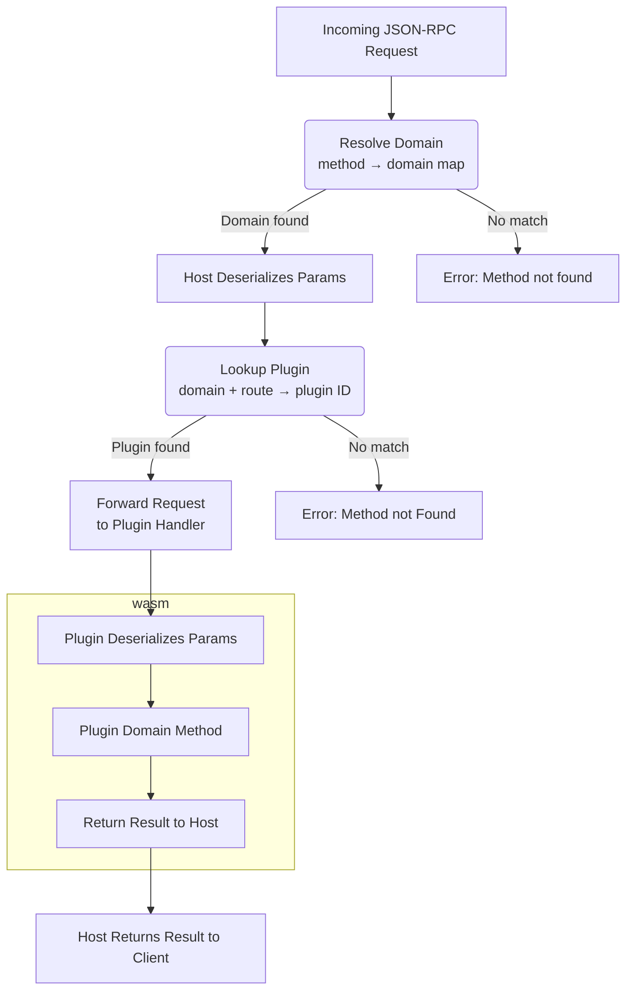

# Resource Management

Tlock is a plugin-first architecture.  I aim to implement everything I can within plugins, and in doing so to give plugins the ability to implement anything they would like, including implementations I did not consider during my design. The goal is to make something simple enough to work with, and flexible enough to build on top of in interesting and unforeseen ways.

Key resources:
- Domains
  - Domains are the typed interfaces used to interact with plugins. A single domain represents a single kind of object. Domains might represent Vaults, Data Providers, User Interfaces, Popups, etc.
- Plugins
  - Plugins are implementations of a domain's interface. Plugins may implement multiple domains, and may register entities to expoe this behavior.
- Entities
  - Entities are instances of objects that implement domains. Each entity belongs to a single domain and is implemented by a plugin.

Importantly, there will generally be a 1:many relationship between plugins and entities. A single plugin may initialize and manage many entities, all with shared state.

> For example: The Vault domain can manage multiple vault addresses, something we want since those multiple addresse may be derived from shared state (IE a single seed phrase). In this case there are multiple vault **entities** pointing to a single plugin for their functionality.

## Routing

One of the host's key jobs is the routing of messages to the respective plugin. The goal of the router is to ensure that messages are, whenever possible, automatically sent to the target (and only the target) plugin or plugins.  Tlock utilizes two kinds of messages, requests and events.

### Requests

Requests are specific messages that should be sent to a single, unique entity.  Often the caller of the request will expect a definitive response, and will wait on that response before proceeding.  The host knows which plugin to route requests to via scoping rules exposed by the plugins. A plugin creating or modifying an entity must attach scoping rules which are dependant on the entity's type. Generally these scoping rules are based on caip asset IDs. 

> For example a vault entity may have the scoping rule `eip155:1:0x8f72fcf695523A6FC7DD97EafDd7A083c386b7b6`, `eip155:56:0xa0b86991c6218b36c1d19d4a2e9eb0ce3606eb48`, or `eip155:_:0x799d0db297dc1b5d114f3562c1ec30c9f7fdae39`. Requests will be forwarded to entities when the request's scope matches the entity's scope, and preferentially be forwarded to more specifically scoped entities.

Different domains will have different scoping rules. So a `eth_personal` request may follow the caip-10 ID for scoping, while `eth_block_number` will follow caip-10. In cases where routing can't be inferred automatically (for example with `keyring_createAccount` or `tlock_ping`), the plugin ID will be used to select a specific plugin. 

### Events

Events are messages which are broadcast to any plugins which are listening to said event.  Events cannot return data.

# Scratchbook
--------------------------------------------------------------

### Requesting Routing

For cases where a plugin needs to make a request to another plugin ID, it can have the host ask the user to select a "default" plugin. The user will be able to select any installed plugin which implements the requested domain, and that plugin's ID will be returned to the original plugin, plus permission to access that plugin.

### Routing implementation

Routing is implemented with two phases. Firstly, each request is passed to the main resolve function which inspects the request and determines which domain it falls under. It then passes the request to a domain-specific resolver which selects the plugin to dispatch based on registered entities.

To facilitate this, the host will use its own API with more context than the external-facing json-rpc apis. The host's api will explicitly contain all the required routing information so a plugin can be selected to handle a particular task. A shim will be required to translate regular requests into the host's API.

PROBLEM: How do I implement this?  Like on an interface level - I essentially have to preprocess each request, sometimes with extra state re the chainID, and generally extracting a param / element from the args.  I then need to route that to the correct plugin.  And I don't want to change the APIs themselves, since I'd like to avoid having two very-similar-looking APIs for requests, one to call on plugins and one to receive requests from the external json-rpc clients.

But for internal use I can make things *a lot* cleaner by having my own API.  One that has the entity routing built-in, instead of inferred based on context clues. Having the various entity IDs integrated into the requests.

Doing it this way would also simplify plugin parsing pretty drastically. The host could use a regular tuple-based approach for parsing params, and then pack them into a struct which could be serialized / deserialized with actual named params for the plugins.

I think the best approach is to have the host's Api use the rich typing - with functions that accept extra context for chainIDs, account addresses, and plugin IDs where appropriate.  Then add a shim for the external API which populates this data.

Another downside is, if I want the api between the host and plugins to be symmetric, I'll have redundant information.  For example, a `keyring_createAccount` call made to the host needs a `plugin_id` param for routing.  But when calling `keyring_createAccount` on the plugin, the pluginId is irrelevant.  Unless I want asymetric APIs, which will add a fair bit of extra work & room for error, I think keeping the API symetric is best.    

Essentially, we act like HA domains.  Different objects implement different namespaces, and each namespace impl is tightly scoped via caip (and probably also some other stuff).

Across different caip-2 namspaces (IE eip155, bip122), things are split via different traits. So routing is trivial.
    - This is the main conceptual difference.  caip namespace IDs are like the HA entity IDs, and automatic routing is highly prioritized.  We want to make sure that the right resource is automatically selected as often as possible.

Across different chains within the same namespace, routing gets a little more complex.  Basically, each interface instance
is scoped to its own caip-2, caip-10, caip-19, etc scope.  Then when I'm performing actions I'll lookup the most specific
provider which implements the function and call it.

So a Eip155Provider might implement most of the json-rpc spec, providing access to an "eth node".  It will be scoped to a 
caip-2 chainId and different instances of (potentially) the same plugin will run concurrently across multiple chains. 
    - Alternatively, I could have a single instance of a plugin running across multiple chains.  But having a single instance per identifier seems simplest and similar to HA's implementation

A Eip155Keyring might implement methods for signing and sending transactions, and be scoped to a caip-10 account id.  That means
it's both on a specific chain and at a specific address.
    - This also means methods change.  I'll need to translate from the generic `personal_sign(message, address)` into (a) routing to the correct Keyring, and (b) removing the address from the request (or maybe not - just keep it in cause why not?  I see no harm).
    - I might also want to support generics here ala caip-363.  But I think I could safely worry about that *later*

For methods with overlap (ie eth_balance for example), both Eip155Provider and Eip155Keyring might provide impls.  But since Eip155Keyring is more specific for accounts it owns, it'll be selected.  This can happen automagically when selecting different impls.

This approach means I need a much more significant glue layer between the external json-rpc and the internal ones.  That's unfortunate, but complexity should be limited to a few specific functions.

We also need to make mappings 1:1 - there can only be a single provider for a given caip-2 id, or a single keyring for a given caip-10 id.
    - But we'll also want some cases where many instances can exist I think. For example, notifiers will exist globally / across all chains, and I might want many of those
      - Or maybe not - I'm not sure what the best approach is here.  This runs into a fundemental difference between tlock and ha - tlock needs to route everything automatically, while ha relies on users to establish connections.  this means tlock inherintly needs a stricter system so it can establish those connections.