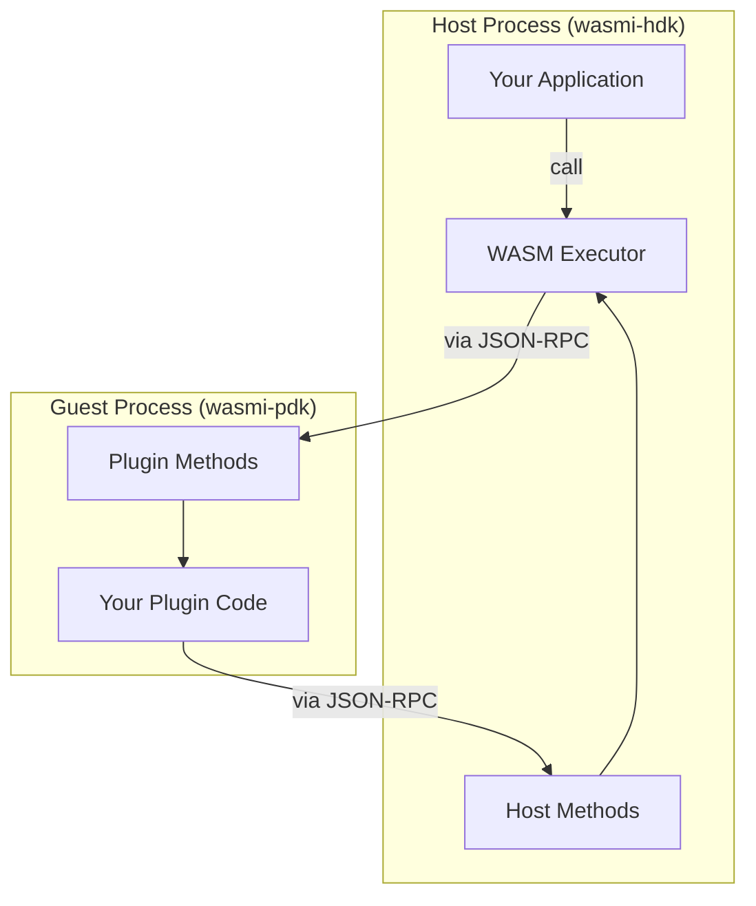

# Wasmi Plugin Framework

A plugin framework built on the [Wasmi](https://github.com/wasmi-labs/wasmi) WebAssembly interpreter. The Wasmi Plugin Framework is designed to run wasm plugins across many architectures, including natively, on mobile, and web browsers (running guest wasm32-wasip1 instances within wasm32-unknown-unknown!).

**Features**

-   Uses JSON-RPC over stdio for communication with host
    -   stdin / stdout for bidirectional JSON-RPC communication
    -   stderr for logs
-   Async compatible host & guest
-   Single-threaded compatible
-   Interpreter-based (works on IOS, thanks to wasmi)

**Limitations**

-   Plugins are stateless. Each host call made to a plugin is made to a new instance of that plugin. Data persistence must be handle by the host.
-   No multi-threading support for guests (wasi-wasip1 limitation)
-   No filesystem or network access access for guests

## Architecture

### How it works
- **Bidirectional RPC**: Host and plugin can call methods on each other via JSON-RPC over stdin/stdout
- **Cooperative execution**: Fuel-based yielding enables async operation in single-threaded environments
- **WASI subset**: Provides subset of wasi syscalls (stdio, time, random, yield, poll_oneoff) for plugin execution

## Examples

See the [host tests](./wasmi-hdk/tests/) and [test-plugin](./test-plugin/) for example usage.